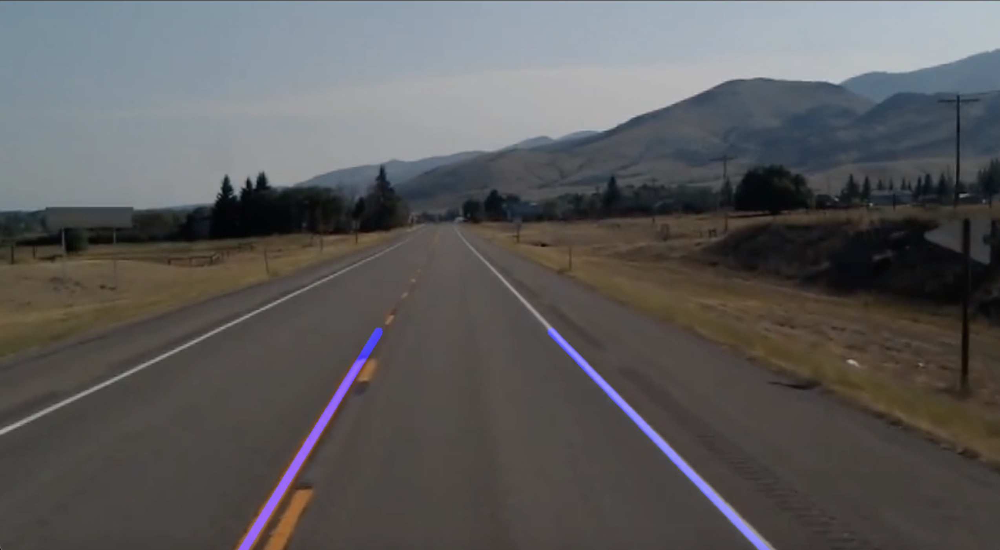

<p align="center">
  
</p>
# Lane Detection Project

This project implements a robust lane detection pipeline using OpenCV and Python. It processes video frames to identify and overlay lane lines on road images, making it ideal for self-driving car demonstrations and computer vision learning.

---

## Sample Output
<p align="center">
  
</p>


---

## Features

- Canny edge detection for robust feature extraction
- Region of interest masking to focus on the road
- Hough Transform for line segment detection
- Averaging and extrapolation of lane lines for smooth visualization
- Handles missing lane lines between frames for stable output
- Real-time video processing

---

## Requirements

- Python 3.x
- OpenCV (`cv2`)
- NumPy
- Matplotlib (optional, for plotting)

Install dependencies with:

```bash
pip install opencv-python numpy matplotlib
```


---

## Usage

1. **Clone the repository and add your video file (e.g., `test2.mp4`) to the project directory.**
2. **Ensure you have a sample image (e.g., `test_image.jpg`) for demonstration.**
3. **Run the script:**
```bash
python lanes.py
```

4. **Press `q` to quit the video window.**

---

## File Overview

- `lanes.py`: Main script for lane detection. Processes video frames and overlays detected lane lines.
- `test_image.jpg`: Sample input image (for demonstration).
- `test2.mp4`: Example video file (not included; add your own).

---

## How It Works

- **Edge Detection:**
Converts each frame to grayscale, applies Gaussian blur, and detects edges with the Canny algorithm.
- **Region of Interest:**
Masks the image to focus only on the region where lanes are expected.
- **Line Detection:**
Uses the Hough Transform to detect line segments in the masked edge image.
- **Lane Line Averaging:**
Separates left and right lane lines based on slope, averages them, and extrapolates to create smooth lines.
- **Drawing Lanes:**
Draws the averaged lane lines on the original frame and displays the result in real time.

---

## Customization

- **Region of Interest:**
Adjust the polygon in `region_of_interest()` to match your camera angle or road type.
- **Hough Transform Parameters:**
Tune `minLineLength`, `maxLineGap`, and `threshold` for better results on different videos.

---

## Example Code Snippet

```python
def canny(image):
    gray = cv2.cvtColor(image, cv2.COLOR_RGB2GRAY)
    blur = cv2.GaussianBlur(gray, (5, 5), 0)
    return cv2.Canny(blur, 50, 150)
```


---
